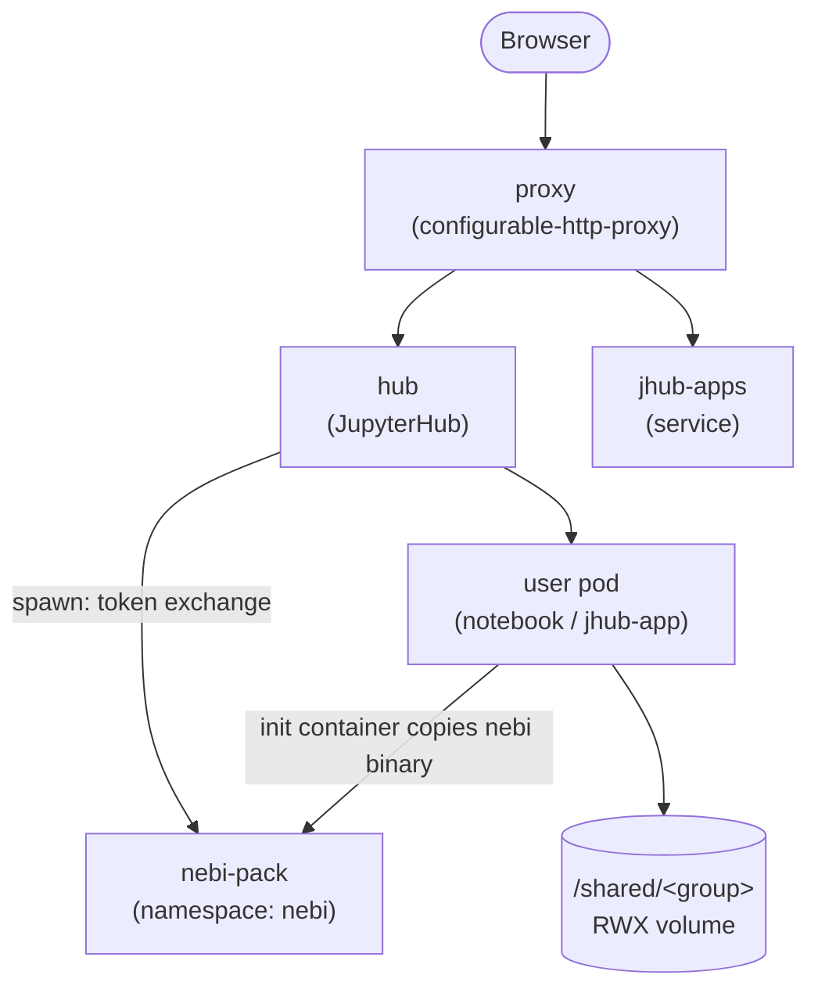

## Components

- **proxy** — `configurable-http-proxy`, routes external traffic to the hub
  and to running user pods/apps.
- **hub** — JupyterHub, runs its own OAuth flow against Keycloak
  (`GenericOAuthenticator`/`KeyCloakOAuthenticator`) so it knows the
  authenticated user's identity, group memberships, and refresh token.
- **jhub-apps** — the companion service that lets users deploy and share
  data science applications (Streamlit, Panel, custom commands) alongside
  plain notebooks.
- **user pods** — spawned per-user notebook servers or jhub-apps. An init
  container copies the `nebi` binary from the `nebi.image` into the pod so
  its version is controlled at deploy time rather than baked into the
  JupyterLab image.
- **nebi-pack** — deployed separately (its own Helm chart, own namespace).
  At spawn time the hub's `pre_spawn_hook` calls Nebi's
  `/api/v1/auth/session` endpoint to exchange the user's Keycloak token; a
  `NetworkPolicy` opens hub → nebi egress on `nebi.port` (default `8460`)
  only when `nebi.internalURL` and `nebi.namespace` are set.

## Nebari Operator integration

When `nebariapp.enabled: true`, the chart renders a `NebariApp` CRD (see
[NebariApp Integration](/nebariapp-integration/)). The Nebari Operator reads
it and provisions:

- The Gateway API `HTTPRoute` (and TLS listener/cert) for the hub's hostname.
- The Keycloak OIDC client the hub authenticates against.
- A card on the Nebari landing page, if `nebariapp.landingPage.enabled: true`.

## Shared storage

Per-group directories are mounted read-write-many into every user pod. See
[Shared Storage](/shared-storage/) for the StorageClass requirements and the
transitional in-cluster NFS mode.
