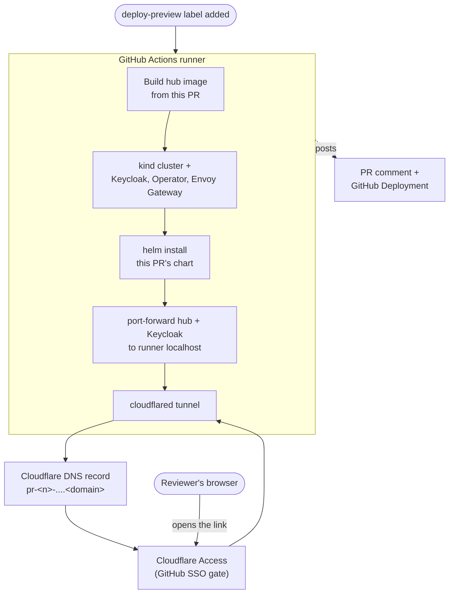

The `k8s-preview` GitHub Actions workflow
(`.github/workflows/k8s-preview.yaml`) deploys this PR's chart into an
ephemeral kind cluster running the full Nebari platform stack (Keycloak +
Nebari Operator + Envoy Gateway, via `nebari-dev/action-nebari-sandbox`),
then exposes it through a per-PR Cloudflare Tunnel behind Cloudflare Access
(GitHub SSO).

## How it works

1. Labeling the PR `deploy-preview` starts the `deploy-preview` job.
2. It builds the hub image from this PR and boots a kind cluster running
   Keycloak, the Nebari Operator, and Envoy Gateway
   (`nebari-dev/action-nebari-sandbox`), then side-loads the built image
   into it.
3. For a non-fork PR, it points the chart's JupyterLab image at this PR's
   own build (see "JupyterLab image" below), then installs the chart with
   `helm upgrade --install`, patches Keycloak's own hostname to match the
   public route, and waits for the Operator to finish provisioning the
   OIDC client.
4. It port-forwards the hub and Keycloak services from the cluster to the
   runner's `localhost`, starts a `cloudflared` tunnel mapping the public
   preview hostnames to those local ports, and points a Cloudflare DNS
   record at the tunnel.
5. It posts the preview URL as a GitHub Deployment and a PR comment.
6. A reviewer opening the link authenticates through Cloudflare Access
   (GitHub SSO) before any request reaches the tunnel. Past Access, traffic
   flows tunnel -> runner port-forward -> cluster service -> pod, and the
   hub runs its own OAuth flow against Keycloak so it knows who signed in.
7. After 20 minutes (or on `extend-preview`/label removal), the tunnel
   closes, the DNS record and tunnel are deleted, and the runner (with its
   kind cluster) is torn down when the job ends.

## Triggering it

Add the `deploy-preview` label to a PR. That label gates who can trigger a
deploy (GitHub label permissions), so a labeled fork PR still runs, using
that fork's own code. Removing the label runs the `cleanup-preview` job,
which cancels any in-flight deploy for that PR, marks the GitHub deployment
inactive, and posts a "stopped" comment.

## Lifetime and the `extend-preview` label

A preview is live for 20 minutes by default (the tunnel step's own
timeout, kept under the job's 90-minute timeout so it self-ends cleanly
instead of GitHub reporting a false "cancelled" run). Adding the
`extend-preview` label resets the deadline to 20 minutes from that moment;
it can be added any number of times, but each add is a reset, not an
addition on top of what's left. The label is polled from inside the running
tunnel step (`scripts/preview/tunnel.py`), not re-triggered as a new
workflow run, so extending is excluded from the workflow's own
`cancel-in-progress` concurrency group.

## Hostnames and TLS

Preview hostnames stay single-level
(`pr-<number>-data-science-pack.<domain>`): the free Cloudflare Universal
SSL certificate on the preview zone only covers the zone itself plus one
wildcard level.

## Authentication

`nebariapp.enabled=true` routes login through a real Operator-provisioned
Keycloak client, the same auth path production deployments use. A test
reviewer account is created directly in Keycloak so a reviewer can sign in
without a real SSO identity; Cloudflare Access in front of the tunnel is the
actual security boundary, so a simple known password for that account is
acceptable.

## JupyterLab image

The hub image is built and side-loaded locally by this workflow, but the
JupyterLab image users actually spawn is built separately by
`build-images.yaml` (multi-arch, pushed to ghcr.io/quay.io on the same PR
trigger). For a non-fork PR, `scripts/preview/pr_image.py` rewrites
`values.yaml`'s singleuser and per-profile image refs, in the ephemeral
checkout only, to that PR's `pr-<number>` tag before the chart deploys.

Fork PRs are skipped: `build-images.yaml` never pushes images for a fork
(no credentials to do so), so the preview keeps the chart's default pinned
JupyterLab image instead of pointing at a tag that doesn't exist.

The two builds aren't ordered against each other. A pod only pulls the
image when a reviewer actually spawns a server, by which point
`build-images.yaml` has usually finished; if not, kubelet retries the pull
automatically once the tag exists; no action is needed either way.

## Implementation notes

- **Sandbox cluster**: kind is pinned to v0.32.0+; older kind can't parse
  the sandbox action's containerd v4 config.
- **Namespace label**: the Operator refuses to reconcile a `NebariApp` in
  any namespace missing `nebari.dev/managed=true`, a deliberate opt-in gate
  since the Operator has cluster-wide RBAC to provision public routing and
  OIDC clients. In a real deployment ArgoCD sets this label itself
  (`managedNamespaceMetadata`) when it creates the namespace; this workflow
  bypasses ArgoCD entirely, so it has to label the namespace by hand.
- **Keycloak hostname patch**: ArgoCD's `selfHeal` reverts a direct `kubectl
  patch`, and Keycloak's own hostname must match the public tunnel route
  before login works. `scripts/preview/keycloak_gitops.py` rewrites the
  GitOps source file instead, so ArgoCD applies and keeps the change.
- **Chart deploy**: runs without `helm --wait`; the hub crash-loops until
  the Operator's Keycloak client `Secret` exists, which happens
  asynchronously. Readiness is polled separately afterward.
- **Secret + restart polling**: the `Secret` existing isn't enough, since
  the Operator populates `issuer-url` on a later reconcile pass, and a
  single hub restart afterward isn't reliable either (kubelet caches
  mounted `Secret` volumes). `scripts/preview/k8s_wait.py` polls for the
  key, then restarts the hub until the value is actually picked up.
- **jhub-apps smoke test**: jhub-apps runs as a subprocess inside the hub
  pod, so a crash there doesn't fail `helm --wait`, it only surfaces later
  as a 502. The workflow checks it directly right after deploy.

## Tunnel and GitHub visibility

- **Named Tunnel**: each PR gets its own named Cloudflare Tunnel sitting
  behind Access, rather than an anonymous quick tunnel.
- **GitHub Deployment**: a Vercel-style deployment box is created via the
  GitHub Deployments API, separate from the sticky PR comment (which
  doesn't move once posted). `required_contexts: []` keeps this preview
  link from gating on unrelated checks like lint or test.
- **Comment timestamps**: rendered with GitHub's `<relative-time>` web
  component, so "Expires in 12 minutes" keeps ticking client-side with no
  manual timezone math or re-editing needed.
- **On expiry**: the deployment is marked inactive and, if a "ready"
  comment was posted, it's re-rendered to the expired state.

## One-time Cloudflare setup

Configured once in the Cloudflare Zero Trust dashboard for this repository:

- Repository variable `PREVIEW_DOMAIN`: the zone name (e.g.
  `openteams.app`).
- A Cloudflare Access application for `*.<PREVIEW_DOMAIN>`, GitHub as the
  identity provider, and a policy scoped to this org.
- Secret `CLOUDFLARE_TUNNEL_ACCOUNT_ID`: that Cloudflare account's ID.
- Secret `CLOUDFLARE_TUNNEL_API_TOKEN`: `Tunnel:Edit` + `Zone:Read` +
  `DNS:Edit`, scoped to the `PREVIEW_DOMAIN` zone/account only. This is
  separate from `CLOUDFLARE_API_TOKEN`, which belongs to the Pages account
  used by `docs.yml`.

## Security model

- **Public exposure is gated before it reaches the cluster**: Cloudflare
  Access sits in front of the tunnel and requires a GitHub SSO login plus
  an org policy match before any request reaches `cloudflared`. Nothing in
  the preview cluster is reachable without passing that gate.
- **The preview cluster has no internal network isolation**: `kindnet`
  doesn't enforce `NetworkPolicy`, so any pod in the cluster can reach any
  other pod in it. Treat the whole cluster as one trust domain, not a
  boundary between services.
- **kind shares the runner's Docker daemon**: a container escaping its pod
  gets host-level Docker access on that ephemeral runner only, not on any
  shared or production infrastructure, and the runner is destroyed with
  the job.
- **A labeled fork PR deploys the fork's own code**: it gets the same
  Cloudflare Access gate, but the hub image built and running is
  unreviewed. The PR comment flags this on every fork deploy.
- **Token scope**: `GITHUB_TOKEN` is limited to `contents:read`,
  `pull-requests:write`, `issues:write`, `deployments:write` for this job.
  The Cloudflare API token can only edit Tunnels and DNS and read the zone,
  scoped to the single `PREVIEW_DOMAIN` zone, not account-wide.
- **Nothing outlives the run**: the tunnel, its DNS record, the Keycloak
  reviewer account, and the kind cluster all exist only for the job's
  lifetime, or until the preview expires or is stopped early.
