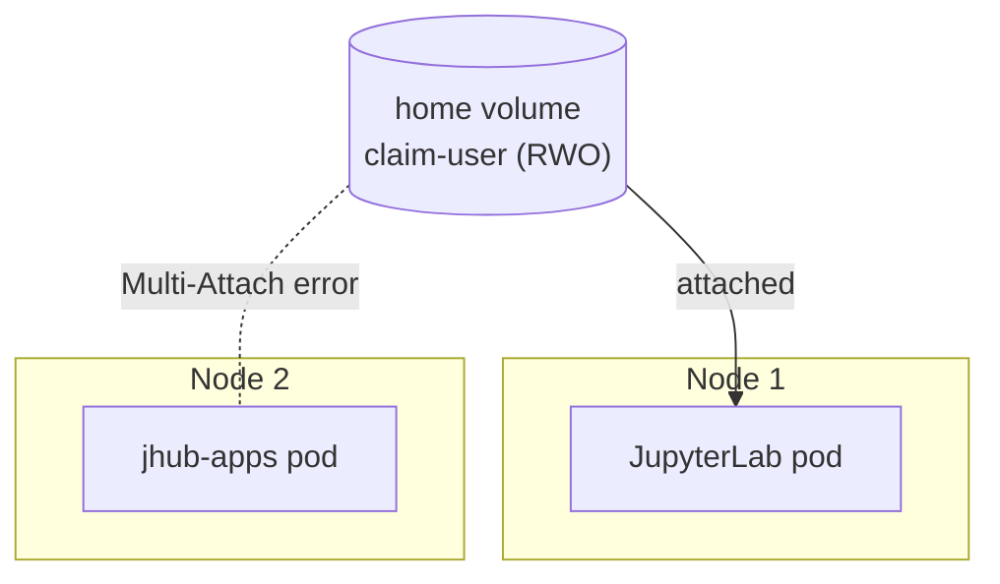
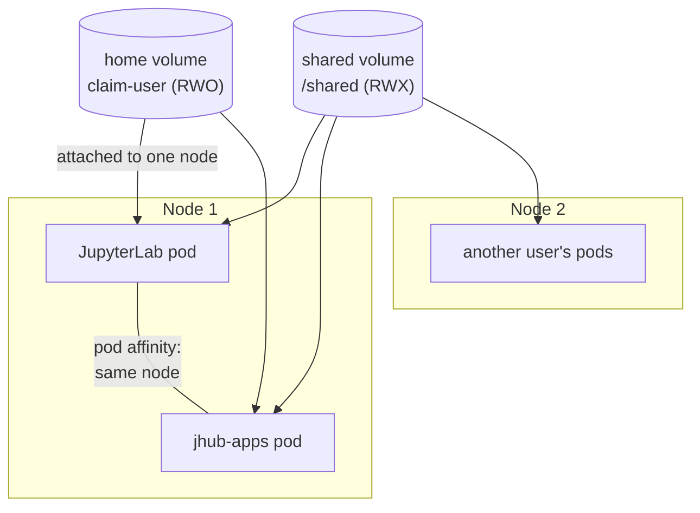

The Data Science Pack constrains all pods belonging to a user, the
JupyterLab server and any jhub-apps application servers, to run on a
single node. This page
explains why that constraint exists, how it is enforced through pod
affinity, and how to diagnose spawn failures caused by scheduling.

## Motivation

The Data Science Pack provisions one home volume per user
(`claim-{username}`) with the
`ReadWriteOnce` [access mode](https://kubernetes.io/docs/concepts/storage/persistent-volumes/#access-modes),
which restricts attachment to a single node at a time.

`ReadWriteMany` is available to the chart and already in use for the
`/shared/<group>` directories, provided by a cluster RWX `StorageClass`
such as Longhorn (see [Shared Storage](/shared-storage/)). Home
directories deliberately do not use it, for performance.

Every `ReadWriteMany` implementation is network file storage. Home
directory workloads (conda and pixi environments, version control,
notebook autosave) consist largely of metadata operations on many small
files; a single Python environment holds tens of thousands of them;
over a network filesystem each operation incurs a round trip, degrading
environment creation and interactive latency by orders of magnitude
compared to node-attached block storage. The `/shared` directories pay
this cost because there is no alternative for them: they must be writable
by many users' pods across nodes concurrently, which only network file
storage provides. A home volume is accessed by a single user's pods, so
it can avoid the cost by keeping those pods on one node.

The consequence of `ReadWriteOnce` home volumes is a scheduling
constraint: all pods belonging to a user must run on the node to which the
user's home volume is attached. The remainder of this page describes how
the chart enforces that constraint and how to diagnose failures related to
it.

## Problem

A user may run multiple pods concurrently: the JupyterLab server and any
number of jhub-apps application servers, all of which mount the same home
volume. If the scheduler places two of these pods on different nodes, the
second pod remains in `ContainerCreating` with a `Multi-Attach` error,
because the volume is already attached to the first node.



## Solution

Every user pod is created with a required inter-pod affinity term that
restricts scheduling to nodes running a pod labeled
`hub.jupyter.org/username=<user>`. For the first pod, the term is
satisfied by the pod's own label: the Kubernetes scheduler permits a pod
to fulfill its own required affinity when the required value matches one
of the pod's labels. Subsequent pods for the same user are placed on the
same node.



The user's pods share one node, so the `ReadWriteOnce` home volume serves
all of them. The `ReadWriteMany` shared volume is unaffected by node
placement and mounts into every user's pods on every node.

The affinity term is constructed by a `modify_pod_hook` in
`config/jupyterhub/01-spawner.py`, which copies the value of the pod's own
`hub.jupyter.org/username` label into the term. The value must not be
produced with the `{username}` template instead: kubespawner derives the
label and the template expansion with different slug rules, so for
usernames that require escaping (such as email addresses) the two values
diverge. A diverged value cannot be satisfied by any node, and every spawn
for the affected user fails at scheduling until the spawn timeout expires.

## Debugging spawn timeouts

JupyterHub deletes the pod when the spawn timeout expires, but the
namespace events outlive it:

```bash
kubectl get events -n <hub-namespace> --sort-by=.lastTimestamp | grep <pod-name>
```

| Event | Cause |
|---|---|
| `didn't match pod affinity rules` (all nodes) | The value in `spec.affinity.podAffinity` does not match the pod's `metadata.labels."hub.jupyter.org/username"`. This cannot occur while the `modify_pod_hook` is intact; it indicates the hook was removed or the value is being templated again. Compare the two fields with the command below while the pod is still `Pending`. |
| `Multi-Attach error` | The previous node still holds the volume attachment, typically after a node failure or while a detach is still in progress, or the co-location affinity has been removed. Check `kubectl get volumeattachment` for the volume, then verify the hook in the hub ConfigMap. |
| `FailedAttachVolume` (volume never attaches) | The storage backend could not provision or place the volume. This is a cluster storage issue, not a chart issue; inspect the volume's status with the tooling of the installed storage layer. |

To compare the username label with the affinity value on a `Pending` pod:

```bash
kubectl get pod <pod> -n <hub-namespace> \
  -o jsonpath='{.metadata.labels.hub\.jupyter\.org/username}{"\n"}{.spec.affinity.podAffinity}'
```

The two values must be identical.
